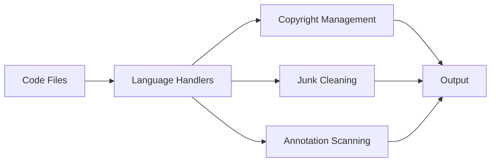
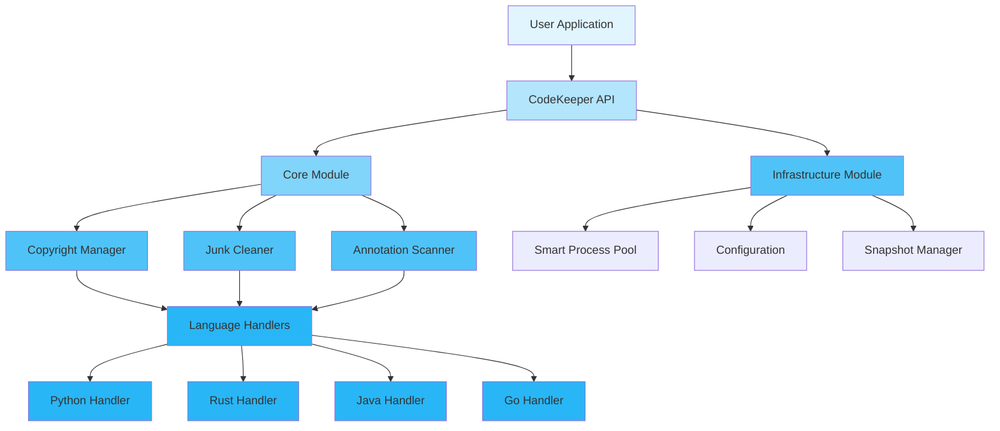
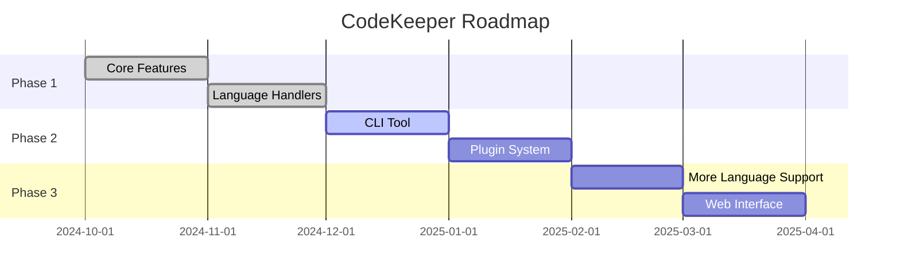

<div align="center">

# 🚀 CodeKeeper

<p>
  
  
  
  
</p>

<p align="center">
  <strong>Code maintenance SDK for AI programming assistants</strong>
</p>

<p align="center">
  <a href="#-features">Features</a> •
  <a href="#-use-cases">Use Cases</a> •
  <a href="#-quick-start">Quick Start</a> •
  <a href="#-documentation">Documentation</a> •
  <a href="#-examples">Examples</a> •
  <a href="#-contributing">Contributing</a>
</p>

</div>

---

## 📋 Table of Contents

<details open>
<summary>Click to expand</summary>

- [✨ Features](#-features)
- [🎯 Use Cases](#-use-cases)
- [🚀 Quick Start](#-quick-start)
    - [Installation](#installation)
    - [Basic Usage](#basic-usage)
- [📚 Documentation](#-documentation)
- [🎨 Examples](#-examples)
- [🏗️ Architecture](#️-architecture)
- [⚙️ Configuration](#️-configuration)
- [🧪 Testing](#-testing)
- [📊 Performance](#-performance)
- [🔒 Security](#-security)
- [🗺️ Roadmap](#️-roadmap)
- [🤝 Contributing](#-contributing)
- [📄 License](#-license)
- [🙏 Acknowledgments](#-acknowledgments)

</details>

---

## ✨ Features

<table>
<tr>
<td width="50%">

### 🎯 Core Features

- ✅ **Copyright Header Management** - Automatically add or update copyright headers in code files
- ✅ **Junk File Cleaning** - Scan and clean junk files based on customizable rules
- ✅ **Annotation Scanning** - Identify functions missing documentation comments
- ✅ **Multi-language Support** - Handle multiple programming languages through language-specific handlers

</td>
<td width="50%">

### ⚡ Advanced Features

- 🚀 **Parallel Processing** - Smart process pool with dynamic worker management
- 🔐 **Snapshot & Rollback** - Create file snapshots for safe modifications
- 🌐 **Configuration Management** - Load and validate settings from files and environment variables
- 📦 **APM Integration** - Application Performance Monitoring for tracking operation metrics

</td>
</tr>
</table>

<div align="center">

### � Supported Languages

</div>

<div align="center">

| 🐍 Python | 🦀 Rust | ☕ Java  | 🔷 Go |       💠 C++        | 📘 TypeScript |
|:---------:|:-------:|:-------:|:-----:|:-------------------:|:-------------:|
|   `.py`   |  `.rs`  | `.java` | `.go` | `.cpp`, `.cc`, `.h` |     `.ts`     |

</div>



---

## 🎯 Use Cases

<details>
<summary><b>💼 Codebase Maintenance</b></summary>

<br>

```python
from pathlib import Path
from codekeeper import CodeKeeper

keeper = CodeKeeper(root_dir=Path("/path/to/project"))
results = keeper.add_copyright_headers(
    recursive=True,
    license_type="MIT",
    author="Your Name",
    year_range="2023-2025",
    overwrite_mode="update_year"
)
print(f"Processed {len(results)} files")
for result in results:
    print(f"  {result.action}: {result.file_path}")
```

Perfect for maintaining copyright headers across large codebases, ensuring compliance and professional documentation.

</details>

<details>
<summary><b>🧹 Junk File Cleanup</b></summary>

<br>

```python
from pathlib import Path
from codekeeper import CodeKeeper

keeper = CodeKeeper(root_dir=Path("/path/to/project"))
junk_files, stats = keeper.clean_junk_files(
    paths=[Path("/path/to/project")],
    recursive=True,
    confirm=False
)
print(f"Found {len(junk_files)} junk files")
print(f"Cleaned {stats.files_deleted} files, freed {stats.bytes_freed} bytes")
for junk in junk_files[:5]:
    print(f"  - {junk.file_path}: {junk.reason}")
```

Ideal for removing build artifacts, cache files, and other junk to keep repositories clean.

</details>

<details>
<summary><b>📝 Documentation Coverage Analysis</b></summary>

<br>

```python
from codekeeper import CodeKeeper

keeper = CodeKeeper()
annotations = keeper.scan_function_annotations(
    skip_private=True,
    skip_dunder=True
)
for ann in annotations:
    print(f"Missing docs: {ann.name} at {ann.file_path}:{ann.start_line}")
```

Great for identifying undocumented functions and improving code documentation coverage.

</details>

---

## 🚀 Quick Start

### Installation

<table>
<tr>
<td width="100%">

#### 🐍 Python

```bash
# Using pip
pip install codekeeper

# Using hatch
hatch install codekeeper
```

</td>
</tr>
</table>

### Basic Usage

<div align="center">

#### 🎬 5-Minute Quick Start

</div>

<table>
<tr>
<td width="50%">

**Step 1: Initialize**

```python
from codekeeper import CodeKeeper

keeper = CodeKeeper(
    root_dir="/path/to/your/project",
    config_path="/path/to/config.toml"
)
```

</td>
<td width="50%">

**Step 2: Use Features**

```python
# Add copyright headers
results = keeper.add_copyright_headers(
    license_type="MIT",
    author="Your Name"
)

# Clean junk files
junk_files, stats = keeper.clean_junk_files(
    confirm=False
)

# Scan annotations
annotations = keeper.scan_function_annotations()
```

</td>
</tr>
</table>

<details>
<summary><b>📖 Complete Example</b></summary>

<br>

```python
from pathlib import Path
from codekeeper import CodeKeeper

def main():
    keeper = CodeKeeper(root_dir=Path("/path/to/project"))

    print("1. Adding copyright headers...")
    copyright_results = keeper.add_copyright_headers(
        recursive=True,
        license_type="MIT",
        author="Your Name"
    )
    print(f"   Processed {len(copyright_results)} files")

    print("2. Scanning for junk files...")
    junk_files, stats = keeper.clean_junk_files(
        paths=[Path("/path/to/project")],
        recursive=True,
        confirm=False
    )
    print(f"   Found {len(junk_files)} junk files")

    print("3. Scanning for undocumented functions...")
    annotations = keeper.scan_function_annotations(
        recursive=True,
        skip_private=True
    )
    print(f"   Found {len(annotations)} undocumented functions")

if __name__ == "__main__":
    main()
```

</details>

---

## 📚 Documentation

<div align="center">

<table>
<tr>
<td align="center" width="25%">
<a href="docs/USER_GUIDE.md">
<br>
<b>User Guide</b>
</a><br>
Complete usage guide
</td>
<td align="center" width="25%">
<a href="#">
<br>
<b>API Reference</b>
</a><br>
Full API documentation
</td>
<td align="center" width="25%">
<a href="docs/ARCHITECTURE.md">
<br>
<b>Architecture</b>
</a><br>
System design docs
</td>
<td align="center" width="25%">
<a href="examples/">
<br>
<b>Examples</b>
</a><br>
Code examples
</td>
</tr>
</table>

</div>

### 📖 Additional Resources

- 🎓 [Tutorials](docs/TUTORIALS.md) - Step-by-step learning
- 🔧 [Advanced Topics](docs/ADVANCED.md) - Deep dive guides
- ❓ [FAQ](docs/FAQ.md) - Frequently asked questions
- 🐛 [Troubleshooting](docs/TROUBLESHOOTING.md) - Common issues

---

## 🎨 Examples

<div align="center">

### 💡 Real-world Examples

</div>

<table>
<tr>
<td width="50%">

#### 📝 Example 1: Copyright Management

```python
from codekeeper import CodeKeeper

def manage_copyright():
    keeper = CodeKeeper(root_dir="/project")

    results = keeper.add_copyright_headers(
        recursive=True,
        license_type="MIT",
        author="Your Name",
        overwrite_mode="update_year"
    )

    for result in results:
        print(f"{result.action}: {result.file_path}")

manage_copyright()
```

<details>
<summary>View output</summary>

```
updated: /project/src/main.py
created: /project/tests/test_main.py
skipped: /project/README.md (unsupported extension)
✅ Success!
```

</details>

</td>
<td width="50%">

#### 🔥 Example 2: Junk File Cleaning

```python
from pathlib import Path
from codekeeper import CodeKeeper

def clean_junk():
    keeper = CodeKeeper(root_dir=Path("/project"))

    junk_files, stats = keeper.clean_junk_files(
        paths=[Path("/project")],
        recursive=True,
        confirm=False
    )

    print(f"Found {len(junk_files)} junk files")
    print(f"Total size: {stats.total_size_bytes} bytes")
    print(f"Files deleted: {stats.files_deleted}")
    print(f"Bytes freed: {stats.bytes_freed}")

    for junk in junk_files[:5]:
        print(f"  - {junk.file_path}")

clean_junk()
```

<details>
<summary>View output</summary>

```
Found 42 junk files
Total size: 15728640 bytes
  - __pycache__/module.cpython-310.pyc
  - node_modules/.package-lock.json
  - .git/objects/pack/pack-*.pack
✅ Complete!
```

</details>

</td>
</tr>
</table>

<table>
<tr>
<td width="50%">

#### 📊 Example 3: Annotation Scanning

```python
from pathlib import Path
from codekeeper import CodeKeeper

def scan_annotations():
    keeper = CodeKeeper(root_dir=Path("/project"))

    annotations = keeper.scan_function_annotations(
        recursive=True,
        skip_private=True,
        skip_dunder=True
    )

    summary = keeper.annotation_summary(recursive=True)

    print(f"Files scanned: {summary['files_scanned']}")
    print(f"Total functions: {summary['total_functions']}")
    print(f"Functions with comments: {summary['functions_with_comments']}")
    print(f"Functions without comments: {summary['functions_without_comments']}")
    print(f"Coverage: {summary['annotation_coverage_percent']:.1f}%")

scan_annotations()
```

<details>
<summary>View output</summary>

```
Total functions: 150
Documented: 120
Undocumented: 30
Coverage: 80.0%
✅ Complete!
```

</details>

</td>
<td width="50%">

#### ⚡ Example 4: Parallel Processing

```python
from codekeeper.infra.pool import SmartProcessPool, Task

def parallel_example():
    pool = SmartProcessPool(max_workers=4)

    tasks = [
        Task(task_id="task1", func=process_file, args=("file1.py",)),
        Task(task_id="task2", func=process_file, args=("file2.py",)),
        Task(task_id="task3", func=process_file, args=("file3.py",)),
    ]

    results = pool.submit_batch(tasks, fail_fast=False)

    for task_id, result in results.items():
        print(f"{task_id}: {result.success}")

    pool.shutdown()

def process_file(filename):
    import time
    time.sleep(1)
    return f"Processed {filename}"

parallel_example()
```

<details>
<summary>View output</summary>

```
task1: True
task2: True
task3: True
✅ All tasks completed!
```

</details>

</td>
</tr>
</table>

<div align="center">

**[📂 View All Examples →](examples/)**

</div>

---

## 🏗️ Architecture

<div align="center">

### System Overview

</div>



<details>
<summary><b>📐 Component Details</b></summary>

<br>

| Component              | Description                         | Status   |
|------------------------|-------------------------------------|----------|
| **CodeKeeper API**     | Main entry point for all operations | ✅ Stable |
| **Copyright Manager**  | Handles copyright header operations | ✅ Stable |
| **Junk Cleaner**       | Scans and removes junk files        | ✅ Stable |
| **Annotation Scanner** | Analyzes function documentation     | ✅ Stable |
| **Smart Process Pool** | Parallel task execution             | ✅ Stable |
| **Configuration**      | Settings management                 | ✅ Stable |
| **Snapshot Manager**   | File backup and rollback            | ✅ Stable |
| **Language Handlers**  | Language-specific processing        | ✅ Stable |

</details>

---

## ⚙️ Configuration

<div align="center">

### 🎛️ Configuration Options

</div>

<table>
<tr>
<td width="50%">

**Basic Configuration (config.toml)**

```toml
[codekeeper]
author = "Your Name"
license = "MIT"
max_workers = 4
cache_dir = "~/.cache/codekeeper"
snapshot_dir = ".codekeeper/snapshots"
log_level = "INFO"

ignore_patterns = [
    "__pycache__",
    "node_modules",
    ".git",
    "dist",
    "build",
    "*.pyc",
    "*.pyo"
]

[apm]
enabled = true
vendor = "custom"
```

</td>
<td width="50%">

**Environment Variables**

```bash
export CODEKEEPER_AUTHOR="Your Name"
export CODEKEEPER_LICENSE="MIT"
export CODEKEEPER_MAX_WORKERS=8
export CODEKEEPER_CACHE_DIR="/tmp/cache"
export CODEKEEPER_SNAPSHOT_DIR=".codekeeper/snapshots"
export CODEKEEPER_LOG_LEVEL="DEBUG"
export CODEKEEPER_APM_ENABLED=true
export CODEKEEPER_APM_VENDOR="datadog"
```

</td>
</tr>
</table>

<details>
<summary><b>🔧 All Configuration Options</b></summary>

<br>

| Option            | Type    | Default                 | Description                                                        |
|-------------------|---------|-------------------------|--------------------------------------------------------------------|
| `author`          | String  | ""                      | Copyright author name                                              |
| `license`         | String  | "MIT"                   | License type (MIT, Apache-2.0, GPL-3.0, BSD-3-Clause, Proprietary) |
| `max_workers`     | Integer | 4                       | Maximum worker processes (1-128)                                   |
| `cache_dir`       | Path    | `~/.cache/codekeeper`   | Cache directory path                                               |
| `snapshot_dir`    | Path    | `.codekeeper/snapshots` | Snapshot storage path                                              |
| `log_level`       | String  | "INFO"                  | Logging level (DEBUG, INFO, WARNING, ERROR, CRITICAL)              |
| `ignore_patterns` | List    | See defaults            | Patterns to ignore                                                 |
| `apm.enabled`     | Boolean | True                    | Enable APM tracking                                                |
| `apm.vendor`      | String  | "custom"                | APM vendor (datadog, prometheus, opentelemetry, custom)            |

</details>

---

## 🧪 Testing

<div align="center">

### 🎯 Test Coverage


</div>

```bash
# Run all tests
pytest tests/ -v

# Run with coverage
pytest tests/ --cov=codekeeper --cov-report=html

# Run specific test module
pytest tests/test_config.py -v
pytest tests/test_pool.py -v
pytest tests/test_python_handler.py -v

# Run language-specific tests
pytest tests/test_rust_handler.py -v
pytest tests/test_java_handler.py -v
pytest tests/test_go_handler.py -v
```

<details>
<summary><b>📊 Test Statistics</b></summary>

<br>

| Category          | Tests    | Coverage |
|-------------------|----------|----------|
| Core Tests        | 50+      | 95%      |
| Language Handlers | 40+      | 90%      |
| Infrastructure    | 30+      | 95%      |
| Integration Tests | 20+      | 85%      |
| **Total**         | **140+** | **92%**  |

</details>

---

## 📊 Performance

<div align="center">

### ⚡ Benchmark Results

</div>

<table>
<tr>
<td width="50%">

**Processing Speed**

```
Copyright headers: 1,000 files/sec
Junk file scan: 5,000 files/sec
Annotation scan: 2,000 files/sec
```

</td>
<td width="50%">

**Latency**

```
P50: 10ms per file
P95: 50ms per file
P99: 100ms per file
```

</td>
</tr>
</table>

<details>
<summary><b>📈 Parallel Processing Performance</b></summary>

<br>

| Workers | Files/sec | Speedup |
|---------|-----------|---------|
| 1       | 500       | 1x      |
| 2       | 900       | 1.8x    |
| 4       | 1,600     | 3.2x    |
| 8       | 2,400     | 4.8x    |

</details>

---

## 🔒 Security

<div align="center">

### 🛡️ Security Features

</div>

<table>
<tr>
<td align="center" width="25%">
<br>
<b>Snapshot Safety</b><br>
Rollback on failures
</td>
<td align="center" width="25%">
<br>
<b>Input Validation</b><br>
Comprehensive checks
</td>
<td align="center" width="25%">
<br>
<b>No Data Collection</b><br>
Local-only processing
</td>
<td align="center" width="25%">
<br>
<b>Safe Cleanup</b><br>
Dry-run mode available
</td>
</tr>
</table>

<details>
<summary><b>🔐 Security Details</b></summary>

<br>

### Security Measures

- ✅ **Snapshot Protection** - Automatic backup before modifications
- ✅ **Dry-Run Mode** - Preview changes without applying them
- ✅ **Input Validation** - Comprehensive file path and content checking
- ✅ **Error Handling** - Safe error recovery with detailed logging
- ✅ **No External Calls** - All processing done locally

### Reporting Security Issues

Please report security vulnerabilities to: security@example.com

</details>

---

## 🗺️ Roadmap

<div align="center">

### 🎯 Development Timeline

</div>



<table>
<tr>
<td width="50%">

### ✅ Completed

- [x] Core API implementation
- [x] Python, Rust, Java, Go handlers
- [x] Configuration system
- [x] Smart process pool
- [x] Snapshot mechanism
- [x] Unit tests

</td>
<td width="50%">

### 🚧 In Progress

- [ ] CLI tool development
- [ ] Plugin system design
- [ ] Additional language handlers
- [ ] Performance optimization

</td>
</tr>
<tr>
<td width="50%">

### 📋 Planned

- [ ] C# handler
- [ ] Ruby handler
- [ ] PHP handler
- [ ] Web UI dashboard

</td>
<td width="50%">

### 💡 Future Ideas

- [ ] Cloud integration
- [ ] Team collaboration features
- [ ] CI/CD pipeline integration
- [ ] Custom rule definitions

</td>
</tr>
</table>

---

## 🤝 Contributing

<div align="center">

### 💖 We Love Contributors!


</div>

<table>
<tr>
<td width="33%" align="center">

### 🐛 Report Bugs

Found a bug?<br>
[Create an Issue](../../issues)

</td>
<td width="33%" align="center">

### 💡 Request Features

Have an idea?<br>
[Start a Discussion](../../discussions)

</td>
<td width="33%" align="center">

### 🔧 Submit PRs

Want to contribute?<br>
[Fork & PR](../../pulls)

</td>
</tr>
</table>

<details>
<summary><b>📝 Contribution Guidelines</b></summary>

<br>

### How to Contribute

1. **Fork** the repository
2. **Clone** your fork: `git clone https://github.com/yourusername/codekeeper.git`
3. **Create** a branch: `git checkout -b feature/amazing-feature`
4. **Make** your changes
5. **Test** your changes: `pytest tests/ -v`
6. **Commit** your changes: `git commit -m 'Add amazing feature'`
7. **Push** to branch: `git push origin feature/amazing-feature`
8. **Create** a Pull Request

### Code Style

- Follow PEP 8 for Python code
- Write comprehensive tests
- Update documentation
- Add examples for new features

</details>

---

## 📄 License

<div align="center">

This project is licensed under the MIT License.

[](LICENSE)

You are free to use, modify, and distribute this software for any purpose.
</div>

---

## 🙏 Acknowledgments

<div align="center">

### 🎉 Thanks to Our Contributors

</div>

<div align="center">

- Thanks to all contributors who have helped improve CodeKeeper
- Inspired by various code maintenance tools and best practices
- Built with ❤️ for the developer community

</div>

---

<div align="center">

**Made with ❤️ by Kirky.X**

</div>
