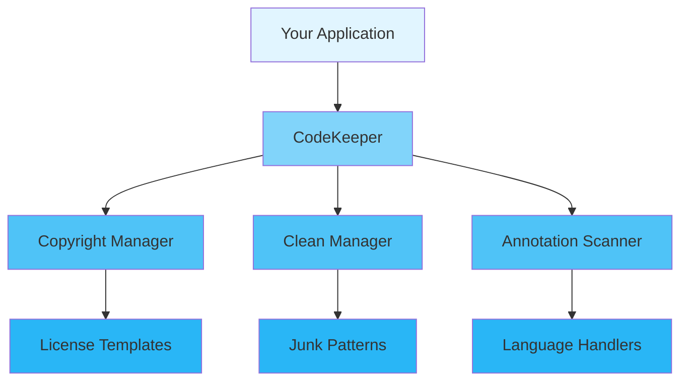

<div align="center">

# 📖 User Guide

### Complete Guide to Using CodeKeeper

[🏠 Home](../README.md) • [📚 Docs](../README.md) • [❓ FAQ](FAQ.md)

---

</div>

## 📋 Table of Contents

- [Introduction](#introduction)
- [Getting Started](#getting-started)
    - [Prerequisites](#prerequisites)
    - [Installation](#installation)
    - [First Steps](#first-steps)
- [Core Concepts](#core-concepts)
- [Basic Usage](#basic-usage)
    - [Initialization](#initialization)
    - [Configuration](#configuration)
    - [Basic Operations](#basic-operations)
- [Advanced Usage](#advanced-usage)
    - [Custom Configuration](#custom-configuration)
    - [Performance Tuning](#performance-tuning)
    - [Error Handling](#error-handling)
- [Best Practices](#best-practices)
- [Common Patterns](#common-patterns)
- [Troubleshooting](#troubleshooting)
- [Next Steps](#next-steps)

---

## Introduction

<div align="center">

### 🎯 What You'll Learn

</div>

<table>
<tr>
<td width="25%" align="center">
<br>
<b>Quick Start</b><br>
Get up and running in 5 minutes
</td>
<td width="25%" align="center">
<br>
<b>Configuration</b><br>
Customize to your needs
</td>
<td width="25%" align="center">
<br>
<b>Best Practices</b><br>
Learn the right way
</td>
<td width="25%" align="center">
<br>
<b>Advanced Topics</b><br>
Master the details
</td>
</tr>
</table>

**CodeKeeper** is a powerful code management toolkit designed to help you maintain code quality through automated copyright header management, junk file cleaning, and function annotation scanning. This guide will walk you through everything from basic setup to advanced usage patterns.

> 💡 **Tip**: This guide assumes basic knowledge of Python and command-line tools. If you're new to Python, check out the [Python Tutorial](https://docs.python.org/3/tutorial/) first.

---

## Getting Started

### Prerequisites

Before you begin, ensure you have the following installed:

<table>
<tr>
<td width="50%">

**Required**

- ✅ Python 3.10+
- ✅ pip (comes with Python)
- ✅ Git

</td>
<td width="50%">

**Optional**

- 🔧 IDE with Python support (VS Code, PyCharm)
- 🔧 Docker (for containerized deployment)
- 🔧 pre-commit hooks

</td>
</tr>
</table>

<details>
<summary><b>🔍 Verify Your Installation</b></summary>

```bash
# Check Python version
python --version
# Expected: Python 3.10.x or higher

# Check pip version
pip --version
# Expected: pip 23.x.x or higher

# Check Git version
git --version
# Expected: git version 2.x.x
```

</details>

### Installation

<div align="center">

#### Choose Your Installation Method

</div>

<table>
<tr>
<td width="50%">

**📦 Using pip (Recommended)**

```bash
# Install from PyPI
pip install codekeeper

# Or install from source
pip install git+https://github.com/your-org/codekeeper.git
```

</td>
<td width="50%">

**🐙 From Source</b></summary>

```bash
git clone https://github.com/your-org/codekeeper
cd codekeeper
pip install -e .
```

</td>
</tr>
</table>

<details>
<summary><b>🌐 Other Installation Methods</b></summary>

**Using Docker**

```bash
docker pull codekeeper:latest
docker run -it codekeeper
```

**Using uv (Modern Python Package Manager)**

```bash
uv pip install codekeeper
```

**Using Poetry**

```bash
git clone https://github.com/your-org/codekeeper
cd codekeeper
poetry install
```

</details>

### First Steps

Let's verify your installation with a simple "Hello World":

```python
from pathlib import Path
from codekeeper import CodeKeeper

def main():
    # Initialize CodeKeeper
    keeper = CodeKeeper(root_dir=Path.cwd())
    
    print("✅ CodeKeeper is ready!")
    
    # Scan for code files
    files = keeper.scan(recursive=True)
    print(f"📁 Found {len(files)} code files")

if __name__ == "__main__":
    main()
```

<details>
<summary><b>🎬 Run the Example</b></summary>

```bash
# Create a new Python file
cat > hello_codekeeper.py << 'EOF'
from pathlib import Path
from codekeeper import CodeKeeper

def main():
    keeper = CodeKeeper(root_dir=Path.cwd())
    print("✅ CodeKeeper is ready!")
    files = keeper.scan(recursive=True)
    print(f"📁 Found {len(files)} code files")

if __name__ == "__main__":
    main()
EOF

# Run it!
python hello_codekeeper.py
```

**Expected Output:**

```
✅ CodeKeeper is ready!
📁 Found 42 code files
```

</details>

---

## Core Concepts

Understanding these core concepts will help you use CodeKeeper effectively.

<div align="center">

### 🧩 Key Components

</div>



### 1️⃣ Copyright Manager

**What it is:** Automatically adds, updates, and validates copyright headers in code files.

**Why it matters:** Ensures consistent license headers across all project files, protecting intellectual property.

**Example:**

```python
from codekeeper import CodeKeeper
from codekeeper.core.copyright import OverwriteMode
from pathlib import Path

keeper = CodeKeeper(root_dir=Path.cwd())

# Add copyright headers to all files
results = keeper.add_copyright_headers(
    recursive=True,
    license_type="MIT",
    author="Your Name",
    year_range="2023-2025",
    overwrite_mode=OverwriteMode.UPDATE_YEAR
)

print(f"Processed {len(results)} files")
```

<details>
<summary><b>📚 Learn More</b></summary>

The Copyright Manager supports multiple license types:
- MIT
- Apache-2.0
- GPL-3.0
- BSD-3-Clause
- Proprietary

It can handle existing headers with different overwrite modes:
- UPDATE_YEAR: Update the year range
- SKIP: Skip files with existing headers
- OVERWRITE: Replace existing headers

</details>

### 2️⃣ Clean Manager

**What it is:** Scans for and optionally removes junk files based on customizable patterns.

**Key Features:**

- ✅ Predefined junk patterns (pycache, temp files, etc.)
- ✅ Custom pattern support via regex
- ✅ Preview mode before deletion
- ✅ Size tracking and reporting

**Example:**

```python
from codekeeper import CodeKeeper
from pathlib import Path

keeper = CodeKeeper(root_dir=Path.cwd())

# Preview junk files
junk_files, stats = keeper.preview_junk_files(
    paths=[Path.cwd()],
    recursive=True
)

print(f"Found {stats.total_files} junk files")
print(f"Total size: {stats.total_size_mb:.2f} MB")

# Clean junk files (with confirmation)
results, stats = keeper.clean_junk_files(
    paths=[Path.cwd()],
    recursive=True,
    confirm=True  # Set to False for preview only
)
```

### 3️⃣ Annotation Scanner

**What it is:** Identifies functions that are missing documentation comments or type annotations.

<table>
<tr>
<td width="50%">

**Without Scanner**

```python
def process_data(data):
    result = []
    for item in data:
        result.append(item * 2)
    return result
```

</td>
<td width="50%">

**With Proper Documentation**

```python
from typing import List

def process_data(data: List[int]) -> List[int]:
    """Process a list of integers by doubling each value.
    
    Args:
        data: List of integers to process
        
    Returns:
        New list with each value doubled
    """
    return [item * 2 for item in data]
```

</td>
</tr>
</table>

**Example:**

```python
from codekeeper import CodeKeeper
from pathlib import Path

keeper = CodeKeeper(root_dir=Path.cwd())

# Get summary of annotation coverage
summary = keeper.annotation_summary(recursive=True)
print(f"Annotation Coverage: {summary['annotation_coverage_percent']:.1f}%")
print(f"Files Scanned: {summary['files_scanned']}")
print(f"Functions Found: {summary['total_functions']}")
print(f"Missing Comments: {summary['functions_without_comments']}")

# Get detailed list of missing annotations
missing = keeper.get_missing_annotations(recursive=True)
for func in missing[:10]:  # Show first 10
    print(f"  - {func.file_path}:{func.line_number} {func.name}")
```

---

## Basic Usage

### Initialization

Every application must initialize CodeKeeper before use:

```python
from pathlib import Path
from codekeeper import CodeKeeper, init_project, is_project_initialized

# Simple initialization (uses defaults)
keeper = CodeKeeper()

# Or with custom root directory
keeper = CodeKeeper(root_dir=Path("/path/to/project"))

# Or with custom configuration
from codekeeper.infra.config import load_config

config = load_config(Path("codekeeper.json"))
keeper = CodeKeeper(
    root_dir=Path.cwd(),
    config_path=Path("codekeeper.json"),
    apm_enabled=True,
    apm_vendor="custom"
)
```

<div align="center">

| Method | Use Case | Performance | Complexity |
|--------|----------|-------------|------------|
| `CodeKeeper()` | Quick start, development | ⚡ Fast | 🟢 Simple |
| `CodeKeeper(root_dir=...)` | Custom project location | ⚡ Fast | 🟢 Simple |
| `CodeKeeper(config_path=...)` | Production, custom needs | ⚡⚡ Optimized | 🟡 Moderate |

</div>

### Configuration

<details open>
<summary><b>⚙️ Configuration Options</b></summary>

```python
from codekeeper import CodeKeeper
from codekeeper.infra.config import CodeKeeperConfig

# Using CodeKeeperConfig
config = CodeKeeperConfig(
    author="Your Name",
    license="MIT",
    max_workers=4,
    cache_dir=Path.home() / ".cache" / "codekeeper",
    snapshot_dir=Path(".codekeeper/snapshots"),
    log_level="INFO",
    ignore_patterns=[
        "__pycache__",
        "node_modules",
        ".git",
        "dist",
        "build",
        "*.pyc",
        "*.pyo",
    ]
)

keeper = CodeKeeper()
```

</details>

<table>
<tr>
<th>Option</th>
<th>Type</th>
<th>Default</th>
<th>Description</th>
</tr>
<tr>
<td><code>author</code></td>
<td>str</td>
<td>""</td>
<td>Copyright author name</td>
</tr>
<tr>
<td><code>license</code></td>
<td>str</td>
<td>"MIT"</td>
<td>License type (MIT, Apache-2.0, GPL-3.0, BSD-3-Clause, Proprietary)</td>
</tr>
<tr>
<td><code>max_workers</code></td>
<td>int</td>
<td>4</td>
<td>Number of worker threads (1-128)</td>
</tr>
<tr>
<td><code>cache_dir</code></td>
<td>Path</td>
<td>~/.cache/codekeeper</td>
<td>Cache directory path</td>
</tr>
<tr>
<td><code>snapshot_dir</code></td>
<td>Path</td>
<td>.codekeeper/snapshots</td>
<td>Snapshot directory for rollbacks</td>
</tr>
<tr>
<td><code>log_level</code></td>
<td>str</td>
<td>"INFO"</td>
<td>Logging level (DEBUG/INFO/WARNING/ERROR/CRITICAL)</td>
</tr>
<tr>
<td><code>ignore_patterns</code></td>
<td>list[str]</td>
<td>[see defaults]</td>
<td>Patterns to ignore during scanning</td>
</tr>
</table>

### Basic Operations

<div align="center">

#### 📝 Core Operations

</div>

<table>
<tr>
<td width="50%">

**Scan Files**

```python
from codekeeper import CodeKeeper
from pathlib import Path

keeper = CodeKeeper(root_dir=Path.cwd())

# Scan for all code files
all_files = keeper.scan(recursive=True)
print(f"Found {len(all_files)} files")

# Scan non-recursively
top_files = keeper.scan(recursive=False)
```

**Analyze File**

```python
result = keeper.analyze(file_path)
print(f"Language: {result['language']}")
```

</td>
<td width="50%">

**Copyright Headers**

```python
# Add copyright headers
results = keeper.add_copyright_headers(
    recursive=True,
    license_type="MIT",
    author="Your Name"
)

# Validate existing headers
validation = keeper.validate_copyright_headers(recursive=True)

# Remove headers
removed = keeper.remove_copyright_headers(recursive=True)
```

</td>
</tr>
</table>

<details>
<summary><b>🎯 Complete Example</b></summary>

```python
from pathlib import Path
from codekeeper import CodeKeeper
from codekeeper.core.copyright import OverwriteMode

def main():
    keeper = CodeKeeper(root_dir=Path.cwd())
    
    # Scan and report
    files = keeper.scan(recursive=True)
    print(f"📁 Scanned {len(files)} files")
    
    # Add copyright headers
    copyright_results = keeper.add_copyright_headers(
        recursive=True,
        license_type="MIT",
        author="Your Name",
        year_range="2023-2025",
        overwrite_mode=OverwriteMode.UPDATE_YEAR
    )
    print(f"📝 Updated copyright in {len(copyright_results)} files")
    
    # Preview junk files
    junk_files, stats = keeper.preview_junk_files(recursive=True)
    print(f"🗑️ Found {len(junk_files)} junk files ({stats.total_size_mb:.2f} MB)")
    
    # Check annotation coverage
    summary = keeper.annotation_summary(recursive=True)
    print(f"📊 Annotation coverage: {summary['annotation_coverage_percent']:.1f}%")

if __name__ == "__main__":
    main()
```

</details>

---

## Advanced Usage

### Custom Configuration

For production environments, you'll want fine-grained control:

```python
from pathlib import Path
from codekeeper import CodeKeeper
from codekeeper.infra.config import load_config, CodeKeeperConfig

# Load from JSON config file
config = load_config(Path("codekeeper.json"))

# Or create config programmatically
config = CodeKeeperConfig(
    author="Your Name",
    license="MIT",
    max_workers=8,
    cache_dir=Path("/var/cache/codekeeper"),
    snapshot_dir=Path("/var/lib/codekeeper/snapshots"),
    log_level="WARNING",
    ignore_patterns=[
        "__pycache__",
        ".git",
        "node_modules",
        "dist",
        "build",
        "*.pyc",
        "*.pyo",
        "*.egg-info",
    ]
)

keeper = CodeKeeper(
    root_dir=Path("/path/to/project"),
    config_path=Path("codekeeper.json"),
    apm_enabled=True,
    apm_vendor="opentelemetry"
)

# Initialize APM with custom config
keeper.initialize_apm({
    "endpoint": "http://apm.example.com",
    "api_key": "your-api-key",
    "service_name": "my-codekeeper"
})
```

<details>
<summary><b>🎛️ Environment Variables</b></summary>

CodeKeeper supports configuration via environment variables:

| Environment Variable | Description | Default |
|---------------------|-------------|---------|
| `CODEKEEPER_AUTHOR` | Copyright author | "" |
| `CODEKEEPER_LICENSE` | License type | "MIT" |
| `CODEKEEPER_MAX_WORKERS` | Worker threads | 4 |
| `CODEKEEPER_CACHE_DIR` | Cache directory | ~/.cache/codekeeper |
| `CODEKEEPER_SNAPSHOT_DIR` | Snapshot directory | .codekeeper/snapshots |
| `CODEKEEPER_LOG_LEVEL` | Log level | "INFO" |
| `CODEKEEPER_IGNORE_PATTERNS` | Comma-separated patterns | (defaults) |

</details>

### Performance Tuning

<div align="center">

#### ⚡ Optimization Strategies

</div>

**1. Worker Pool Configuration**

```python
from codekeeper import CodeKeeper
from pathlib import Path

# Increase workers for large projects
keeper = CodeKeeper(
    root_dir=Path("/path/to/large/project"),
    config_path=Path("codekeeper.json")
)

# Check performance metrics
perf_summary = keeper.get_performance_summary()
print(f"Operations: {perf_summary}")
```

**2. Batch Operations**

<table>
<tr>
<td width="50%">

❌ **Inefficient**

```python
for file in files:
    result = keeper.add_copyright_header(file)
```

</td>
<td width="50%">

✅ **Efficient**

```python
# Use recursive=True for batch processing
results = keeper.add_copyright_headers(
    recursive=True,
    license_type="MIT",
    author="Your Name"
)
```

</td>
</tr>
</table>

**3. APM Monitoring**

```python
from codekeeper import CodeKeeper
from pathlib import Path

keeper = CodeKeeper(
    root_dir=Path.cwd(),
    apm_enabled=True,
    apm_vendor="prometheus"
)

# Perform operations
keeper.scan(recursive=True)
keeper.add_copyright_headers(recursive=True)

# Get performance report
report = keeper.get_apm_report()
print(f"APM Report: {report}")

# Get performance summary
summary = keeper.get_performance_summary()
print(f"Performance: {summary}")

# Flush APM data
keeper.flush_apm()
```

### Error Handling

<div align="center">

#### 🚨 Handling Errors Gracefully

</div>

```python
from pathlib import Path
from codekeeper import CodeKeeper
from codekeeper.security import InvalidPathError

def safe_operations():
    keeper = CodeKeeper(root_dir=Path.cwd())
    
    try:
        # Try to scan files
        files = keeper.scan(recursive=True)
        print(f"✅ Found {len(files)} files")
        
    except InvalidPathError as e:
        print(f"⚠️ Invalid path: {e}")
        print("Please check the root directory path")
        
    except PermissionError as e:
        print(f"❌ Permission denied: {e}")
        print("Please check file permissions")
        
    except Exception as e:
        print(f"❌ Unexpected error: {e}")
        raise

if __name__ == "__main__":
    safe_operations()
```

<details>
<summary><b>📋 Error Types</b></summary>

| Error Type | Description | Recovery Strategy |
|------------|-------------|-------------------|
| `InvalidPathError` | Path validation failed | Check and correct path |
| `PermissionError` | File access denied | Check permissions |
| `ConfigFileError` | Config file issues | Verify config file |
| `ConfigurationError` | Invalid config values | Fix configuration |
| `OSError` | System-level errors | Check system state |

</details>

---

## Best Practices

<div align="center>

### 🌟 Follow These Guidelines

</div>

### ✅ DO's

<table>
<tr>
<td width="50%">

**Initialize Early**

```python
from pathlib import Path
from codekeeper import CodeKeeper

def main():
    # Initialize at the start
    keeper = CodeKeeper(root_dir=Path.cwd())
    
    # Then use the library
    do_work(keeper)
```

</td>
<td width="50%">

**Use Type Hints**

```python
from pathlib import Path
from codekeeper import CodeKeeper

def process_project(root: Path) -> dict:
    keeper = CodeKeeper(root_dir=root)
    files = keeper.scan(recursive=True)
    return {"files": files}
```

</td>
</tr>
<tr>
<td width="50%">

**Handle Errors Properly**

```python
from codekeeper.security import InvalidPathError

try:
    result = keeper.scan(recursive=True)
except InvalidPathError as e:
    print(f"Invalid path: {e}")
    return []
```

</td>
<td width="50%">

**Use Context Managers**

```python
from pathlib import Path
from codekeeper import CodeKeeper

def analyze_project(root_path: Path):
    keeper = CodeKeeper(root_dir=root_path)
    
    # Scan files
    files = keeper.scan(recursive=True)
    
    # Check coverage
    summary = keeper.annotation_summary(recursive=True)
    
    return summary
```

</td>
</tr>
</table>

### ❌ DON'Ts

<table>
<tr>
<td width="50%">

**Don't Use Hardcoded Paths**

```python
# ❌ Bad
keeper = CodeKeeper(root_dir="/home/user/project")

# ✅ Good
from pathlib import Path
keeper = CodeKeeper(root_dir=Path.cwd())
```

</td>
<td width="50%">

**Don't Ignore Exceptions**

```python
# ❌ Bad
result = keeper.scan()

# ✅ Good
try:
    result = keeper.scan(recursive=True)
except Exception as e:
    print(f"Scan failed: {e}")
    result = []
```

</td>
</tr>
</table>

### 💡 Tips and Tricks

> **🔥 Performance Tip**: For large projects, use preview mode first:
> ```python
> junk_files, stats = keeper.preview_junk_files(recursive=True)
> print(f"Will clean: {stats.total_size_mb:.2f} MB")
> ```

> **🔒 Security Tip**: Always validate paths before processing:
> ```python
> from codekeeper.security import is_safe_path
> if not is_safe_path(path, root_dir):
>     raise InvalidPathError(f"Unsafe path: {path}")
> ```

> **📊 Monitoring Tip**: Enable APM for production monitoring:
> ```python
> keeper = CodeKeeper(
>     root_dir=Path.cwd(),
>     apm_enabled=True,
>     apm_vendor="opentelemetry"
> )
> ```

---

## Common Patterns

### Pattern 1: Project Audit

```python
from pathlib import Path
from codekeeper import CodeKeeper
from codekeeper.core.copyright import OverwriteMode

def audit_project(root_dir: Path) -> dict:
    """Perform a complete audit of the project."""
    keeper = CodeKeeper(root_dir=root_dir)
    
    # Scan files
    files = keeper.scan(recursive=True)
    
    # Check copyright headers
    copyright_results = keeper.validate_copyright_headers(recursive=True)
    missing_copyright = sum(1 for r in copyright_results if not r.success)
    
    # Check annotations
    annotation_summary = keeper.annotation_summary(recursive=True)
    
    # Preview junk files
    junk_files, junk_stats = keeper.preview_junk_files(recursive=True)
    
    return {
        "total_files": len(files),
        "files_missing_copyright": missing_copyright,
        "annotation_coverage": annotation_summary["annotation_coverage_percent"],
        "junk_files": len(junk_files),
        "junk_size_mb": junk_stats.total_size_mb,
    }

if __name__ == "__main__":
    audit = audit_project(Path.cwd())
    print(f"Audit Results: {audit}")
```

### Pattern 2: Batch Copyright Update

```python
from pathlib import Path
from codekeeper import CodeKeeper
from codekeeper.core.copyright import OverwriteMode

def update_copyright_all(
    root_dir: Path,
    license_type: str = "MIT",
    author: str = "Your Name"
) -> dict:
    """Update copyright headers in all files."""
    keeper = CodeKeeper(root_dir=root_dir)
    
    results = keeper.add_copyright_headers(
        recursive=True,
        license_type=license_type,
        author=author,
        year_range="2023-2025",
        overwrite_mode=OverwriteMode.UPDATE_YEAR,
        skip_if_exists=True
    )
    
    return {
        "processed": len(results),
        "updated": sum(1 for r in results if r.success),
        "skipped": sum(1 for r in results if not r.success),
    }

if __name__ == "__main__":
    result = update_copyright_all(Path.cwd())
    print(f"Updated {result['updated']} files (skipped {result['skipped']})")
```

### Pattern 3: Annotation Report

```python
from pathlib import Path
from codekeeper import CodeKeeper

def generate_annotation_report(root_dir: Path) -> None:
    """Generate a detailed annotation coverage report."""
    keeper = CodeKeeper(root_dir=root_dir)
    
    # Get summary
    summary = keeper.annotation_summary(recursive=True)
    
    print(f"Annotation Coverage Report")
    print(f"==========================")
    print(f"Files Scanned: {summary['files_scanned']}")
    print(f"Total Functions: {summary['total_functions']}")
    print(f"With Comments: {summary['functions_with_comments']}")
    print(f"Without Comments: {summary['functions_without_comments']}")
    print(f"Coverage: {summary['annotation_coverage_percent']:.1f}%")
    
    # Get detailed missing annotations
    missing = keeper.get_missing_annotations(recursive=True)
    
    if missing:
        print(f"\nFunctions Missing Documentation:")
        for func in sorted(missing, key=lambda x: x.file_path)[:20]:
            print(f"  {func.file_path}:{func.line_number} - {func.name}")

if __name__ == "__main__":
    generate_annotation_report(Path.cwd())
```

---

## Troubleshooting

<details>
<summary><b>❓ Problem: Initialization fails with "already initialized"</b></summary>

**Solution:**

CodeKeeper doesn't have a global initialization state, but you should check if paths are valid:

```python
from pathlib import Path
from codekeeper import CodeKeeper

root = Path("/path/to/project")

if not root.exists():
    print(f"❌ Directory does not exist: {root}")
elif not root.is_dir():
    print(f"❌ Path is not a directory: {root}")
else:
    keeper = CodeKeeper(root_dir=root)
    print("✅ CodeKeeper initialized successfully")
```

</details>

<details>
<summary><b>❓ Problem: Performance is slower than expected</b></summary>

**Diagnosis:**

1. Check the number of files being processed
2. Verify worker configuration
3. Check for I/O bottlenecks

**Solution:**

```python
from codekeeper import CodeKeeper
from pathlib import Path

# Use appropriate worker count
keeper = CodeKeeper(
    root_dir=Path.cwd(),
    config_path=Path("codekeeper.json")
)

# Check performance metrics
perf = keeper.get_performance_summary()
print(f"Performance metrics: {perf}")
```

</details>

<details>
<summary><b>❓ Problem: Junk file detection misses some files</b></summary>

**Solution:**

Register custom patterns:

```python
from codekeeper import CodeKeeper
from pathlib import Path

keeper = CodeKeeper(root_dir=Path.cwd())

# Register custom junk pattern
keeper.register_junk_pattern(
    pattern=r"\.bak$",
    name="backup_files",
    _description="Backup files",
    _severity="medium"
)

# Preview again
junk_files, stats = keeper.preview_junk_files(recursive=True)
print(f"Found {len(junk_files)} junk files")
```

</details>

<details>
<summary><b>❓ Problem: Copyright headers not being added</b></summary>

**Solution:**

1. Check file extensions are supported
2. Verify overwrite mode
3. Check if files already have headers:

```python
from codekeeper import CodeKeeper
from codekeeper.core.copyright import OverwriteMode
from pathlib import Path

keeper = CodeKeeper(root_dir=Path.cwd())

# Validate existing headers
results = keeper.validate_copyright_headers(recursive=True)
for result in results:
    if not result.success:
        print(f"File: {result.file_path}, Issue: {result.message}")

# Add with overwrite mode
add_results = keeper.add_copyright_headers(
    recursive=True,
    license_type="MIT",
    author="Your Name",
    overwrite_mode=OverwriteMode.OVERWRITE  # Force overwrite
)
```

</details>

<div align="center">

**💬 Still need help?** [Open an issue](../../issues) or [join our Discord](https://discord.gg/codekeeper)

</div>

---

## Next Steps

<div align="center">

### 🎯 Continue Your Journey

</div>

<table>
<tr>
<td width="33%" align="center">
<a href="TUTORIALS.md">
<br>
<b>📚 Tutorials</b>
</a><br>
Step-by-step learning
</td>
<td width="33%" align="center">
<a href="ADVANCED.md">
<br>
<b>🔧 Advanced Topics</b>
</a><br>
Deep dive into features
</td>
<td width="33%" align="center">
<a href="../examples/">
<br>
<b>💻 Examples</b>
</a><br>
Real-world code samples
</td>
</tr>
</table>

---

<div align="center">

**[📖 API Reference](../api/)** • **[❓ FAQ](FAQ.md)** • **[🐛 Report Issue](../../issues)**

Made with ❤️ by the CodeKeeper Team

[⬆ Back to Top](#-user-guide)

</div>
